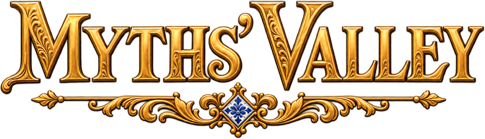

# Myths' Valley 3D



**Um presente para Pedro: memória, vida cotidiana e folclore em um arraial da
Bahia, Brasil, em 1887.** Myths' Valley é um jogo em terceira pessoa ambientado
em Bom Jesus dos Pobres, no Recôncavo Baiano. Você chega pelo píer, herda uma
casa de taipa e aprende com Pedro e os moradores a viver entre a vila, a mata
e a maré. A dedicatória é para Pedro Nolasco da Encarnação, tataravô do autor;
Pedro, o guia do jogo, integra essa construção de memória.

Este repositório público contém o **protótipo 3D em desenvolvimento**, feito
com Godot 4.7.2 Standard, GDScript e Forward+. O projeto abre na raiz e funciona
sem outro checkout. A identificação da build fica em
[`data/historico_3d.json`](data/historico_3d.json).

**Jogar:** [página em português](https://mythsvalley.app.br/jogar) ·
[English play page](https://mythsvalley.app.br/en/play) ·
[download Windows em inglês](https://mythsvalley.app.br/en/download/windows).
Essas páginas entregam a build atual; o jogo Windows precisa ser baixado e
executado localmente. O site é uma publicação separada, com instruções, diário
e visualização de modelos 3D, disponível em [mythsvalley.app.br](https://mythsvalley.app.br/).

## English overview

*A gift for Pedro: step into an 1887 Bahia, Brazil, village of living memory,
everyday life and folklore.* Explore Bom Jesus dos Pobres in third person,
meet its villagers and follow Pedro's introduction to village life. The
prototype includes quest chains, tools, gathering, fishing, crafting, combat,
inventory, equipment and three save slots. Some systems and story content are
still being developed. Portuguese, English and Spanish text structures are
present, with translations still in progress; recorded voices are in Brazilian
Portuguese. The website has Portuguese and English versions.

The playable demo is a **Windows executable**, not a browser game. Download
the ZIP from the [English download page](https://mythsvalley.app.br/en/download/windows),
extract it and open `MythsValley3D.exe`; no Godot installation or API key is
needed. Choose **PLAY** for a saved game or **EXPLORE** for an unsaved visit.
Start at the pier and talk to Pedro with **E**. Move with **WASD**, tap **Shift**
to toggle running, use **Space** to jump and **Esc** for settings and controls.

This is a narrative spin-off of **Batalha de Mitos**. According to the author's
development account, the game design, playable prototypes and essentially all
game assets were developed after the event's email invitation, during the
Tripothon development period. The initial 2D experiment began in that same
period, and some logic, data and UI were adapted from it into the 3D game.
The 2D Git history begins on 21 September 2026; the 3D history begins on
23 September 2026. These dates document the repositories, not the invitation
date. The existing story world and the work produced for the event are
distinguished in the [project history](docs/projeto/CHANGELOG_3D.md).

## O que já se pode experimentar

| Parte do vale | Comportamento implementado |
| --- | --- |
| Exploração | Câmera em terceira pessoa, movimento por teclado ou clique, corrida, salto, mapa e minimapa com objetivo em foco |
| Lugar e tempo | Terreno e costa baseados em dados geográficos, marés, água rasa e profunda, passagem do dia, vegetação e ambiente por proximidade |
| Moradores e missões | Pedro acompanha a chegada; seis cadeias de missão usam dados próprios, falas, entregas, objetivos e recompensas |
| Trabalho e recursos | Ferramentas, coleta, pesca, receitas, cozinha, oficina, venda e obras; a integração de todos os sistemas continua em desenvolvimento |
| Corpo e progresso | Vida, energia, vigor da corrida, inventário de 30 espaços, equipamento e árvore de talentos |
| Histórias | Cartas, pactos, cordéis, almanaque, afinidade e fé, com conteúdo e gatilhos ainda sendo ampliados |
| Partidas | Três vagas, resumo no menu, salvamento e retomada; EXPLORAR funciona sem gravar uma partida |
| Apresentação | Identidade em talha dourada, sobrevoo do menu, modelos Tripo com rig e animações, música por período e vozes em português brasileiro |

A presença de um sistema no código não significa que toda a campanha, todas
as telas ou todos os gatilhos estejam concluídos. O [plano](docs/projeto/PLANO.md)
e as [issues](https://github.com/acentauric/myths-valley-3d/issues) registram
essas próximas etapas. As traduções ainda têm lacunas, e os requisitos mínimos
continuam em medição: a referência documentada é uma GeForce GTX 1660 Ti,
não uma garantia para qualquer máquina.

## Como começar e controles

Na build Windows, extraia o ZIP inteiro e abra `MythsValley3D.exe`.
**JOGAR** escolhe uma vaga vazia ou continua uma partida; **EXPLORAR** abre
um passeio livre. Comece no píer, converse com Pedro e siga o objetivo do HUD
e o marcador do minimapa. O menu oferece os ajustes de idioma, áudio, câmera
e teclas; os atalhos abaixo são os de fábrica.

| Entrada | Ação |
| --- | --- |
| WASD / setas | Andar; a preferência escolhe o esquema |
| Shift / Espaço | Alternar corrida / pular |
| Mouse / C ou Tab | Orientar a câmera / alternar câmera livre e travada |
| Clique direito / duplo clique | Caminhar até o alvo / correr até ele |
| E | Conversar e interagir; a ação depende do alvo e da ferramenta |
| 1–9 e 0 / rodinha | Escolher o espaço da barra de mão |
| I / J | Mochila / painel de missões, cartas e ações do lugar |
| K / L / P | Talentos / almanaque / moradores |
| M / Esc | Mapa / menu e controles |

O [guia de jogabilidade](docs/experiencia/COMO_JOGAR_3D.md) detalha os gestos,
o combate, a fala longa, os ajustes e os atalhos de desenvolvimento.
Os saves e as preferências ficam no diretório de usuário
`MythsValleyPrototype3D`, separado dos arquivos instalados.

## Tripo, arte e som

O Tripo é a linha principal dos assets com identidade: casas, igreja,
barcos, árvores, moradores, itens e objetos de trabalho. O fluxo registrado
é **referência ou prompt → Modelo HD → Malha Smart → GLB com texturas →
integração no Godot**. Os personagens recebem rig e clipes de animação;
escala, colisões, localização, LOD e interação são ajustados no jogo.

O catálogo em [`catalogo_assets.gd`](scripts/prototipo_3d/catalogo_assets.gd)
é a referência de caminhos e dimensões. A produção em lote está documentada
em [Assets Tripo](docs/arte/ASSETS_TRIPO.md), com os registros `ORIGEM.md`
por pasta. Terreno, caminhos e vegetação distante usam geração procedural;
um estilo visual procedural alternativo permite comparação no menu.

A identidade visual usa imagens geradas com OpenAI, fontes Cinzel e
Cormorant Garamond e ornamentos em ouro e cobalto. Música, efeitos e vozes
foram produzidos pela equipe de forma generativa com ElevenLabs. A fonte
Miva também é uma criação da equipe, com direitos pertencentes ao projeto.
Ícones herdados da interface têm origem PixelLab. Os [créditos](assets/CREDITOS.md)
e registros de origem distinguem a produção própria e as fontes externas. O repositório
público, por si só, não define uma licença geral de reutilização dos assets.

## Origem e evolução

Myths' Valley deriva do **enredo** de [Batalha de Mitos](https://batalhademitos.com.br/).
O autor situa o início do design e da produção dos protótipos após o convite
do Tripothon recebido por email. O experimento 2D começou no mesmo período;
parte das regras, dados e interface foi adaptada para o 3D. A contribuição
do evento inclui a implementação jogável e a produção e integração dos assets,
preservando a transparência sobre o universo narrativo já existente.

| Marco registrado no Git | Evolução |
| --- | --- |
| 23/09/2026 | Início do histórico 3D e primeiros testes jogáveis |
| 26–28/09/2026 | Lotes de modelos Tripo, retopologia, personagens, espécies locais, áudio e identidade visual |
| 30/09–01/10/2026 | Cadeias de missão, telas e retomada de partidas; o 3D passa a um repositório próprio |
| 02/10/2026 | Montagem do vale e sobrevoo do menu melhorados |
| 03/10/2026 | Builds Windows publicadas, atualização pelo site e equipe atual nos créditos |

O [changelog](docs/projeto/CHANGELOG_3D.md) descreve as mudanças efetivas;
o [histórico de desenvolvimento](docs/projeto/HISTORICO_DESENVOLVIMENTO_3D.md)
preserva decisões e planos anteriores, que podem ter sido superados.
A equipe atual é **Ramon Santos, Renato Leal e Matheus Ché**, da Alpha Centauri.

## Abrir o código

Instale **Godot 4.7.2 Standard**, Git e Git LFS. O jogador da build distribuída
não precisa dessas ferramentas. Para o desenvolvimento:

```powershell
git lfs install
git clone https://github.com/acentauric/myths-valley-3d.git
cd myths-valley-3d
git lfs pull
.\JOGAR_3D.cmd
```

O atalho usa a instalação em `C:\Tools\Godot` e aceita `-Godot CAMINHO.exe`,
`-Compatibility` e `-Lugar igreja`. Também se pode importar `project.godot`
no Project Manager e executar o projeto. Modelos GLB, FBX históricos e WAV
usam Git LFS: sem baixar os objetos, o clone contém apenas ponteiros.

| Pasta | Conteúdo |
| --- | --- |
| `assets/` | Modelos, texturas, interface, fontes, áudio e registros de origem |
| `scenes/` | Abertura, vale, personagem e terreno editável |
| `scripts/` | Sistemas, autoloads, interface e mundo |
| `data/` | Moradores, missões, regras, geografia e histórico de builds |
| `tests/` | Verificações de comportamento e regressão |
| `tools/` | Testes, exportação e preparação de mapas, modelos e áudio |
| `docs/` | Design, arquitetura, mundo, produção e planejamento |

`scripts/compartilhado/` mantém o nome e os UIDs da derivação. Os sistemas
pertencem agora ao 3D e evoluem aqui; não há sincronização automática com
o outro repositório. Veja a [arquitetura](docs/projeto/ARQUITETURA.md).

## Testar, exportar e atualizar

```powershell
.\tools\prototipo_3d\testar.ps1
.\tools\prototipo_3d\testar.ps1 -Teste salvamento
.\tools\prototipo_3d\testar.ps1 -Teste seguranca_arquivos
```

Cada teste usa um perfil temporário, teto de execução e conferência de erros
de compilação. O runner encerra apenas processos que ele próprio iniciou.
As verificações gráficas também exigem execução com o renderer normal;
detalhes em [Validação](docs/projeto/VALIDACAO.md). Trabalho novo parte de uma
issue e de `feature/<nome>`; a bateria completa precede cada commit.

Mudanças de código são salvas no repositório. A publicação de uma nova build
fica para uma versão mais estável, fechada pelo autor; cada commit não exige
uma nova exportação. Ao fechar uma build, instale os templates de exportação
da mesma versão da engine e execute:

```powershell
New-Item -ItemType Directory -Path build/windows -Force
& 'C:\Tools\Godot\Godot_v4.7.2-stable_win64_console.exe' --headless --path . --export-release 'Windows Desktop' build/windows/MythsValley3D.exe
```

O preset embute os recursos em um único executável. O pacote publicado traz
esse EXE e, opcionalmente, instruções. A atualização consulta o site, limita
o download à origem permitida, verifica tamanho e SHA-256 e valida o ZIP antes
de extrair. Conserva o executável anterior durante a troca. A distribuição
ainda confia no servidor HTTPS: o hash vindo do mesmo servidor não equivale
a uma assinatura independente da publicação.

O jogo e os testes não precisam de chaves. Credenciais locais, caches,
builds e arquivos brutos ficam fora do Git. As ferramentas de produção de IA
usam credenciais externas ao código e só geram conteúdo pago quando solicitado.

As validações de segurança descritas acima estão no código atual do
repositório. A distribuição pública permanece na Build #8; ela antecede
essas correções, que entrarão na próxima build fechada pelo autor.
