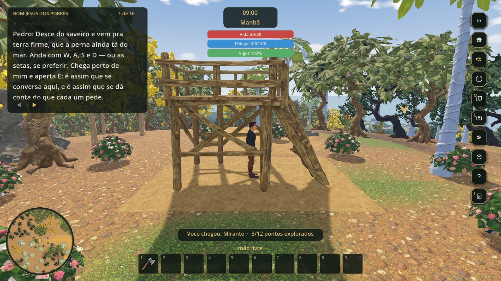
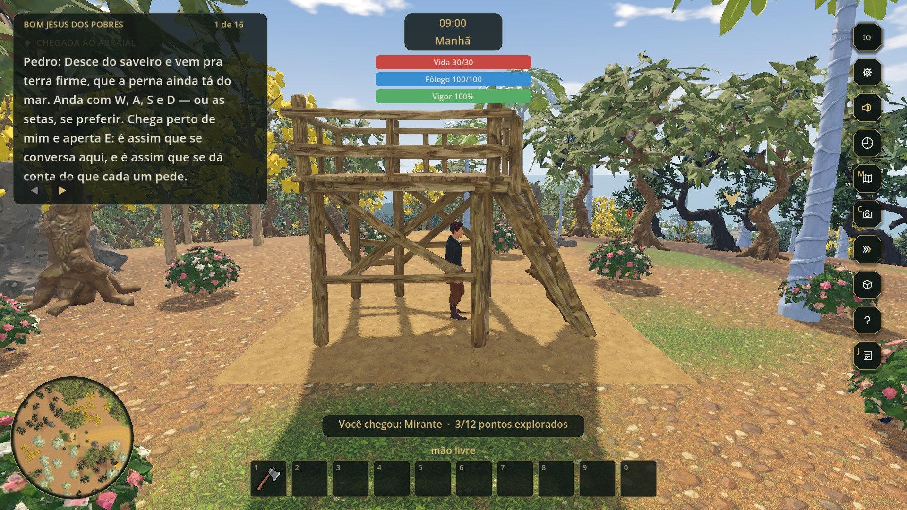
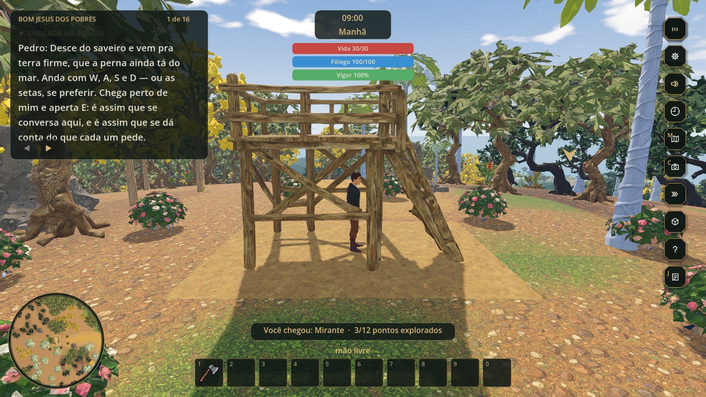
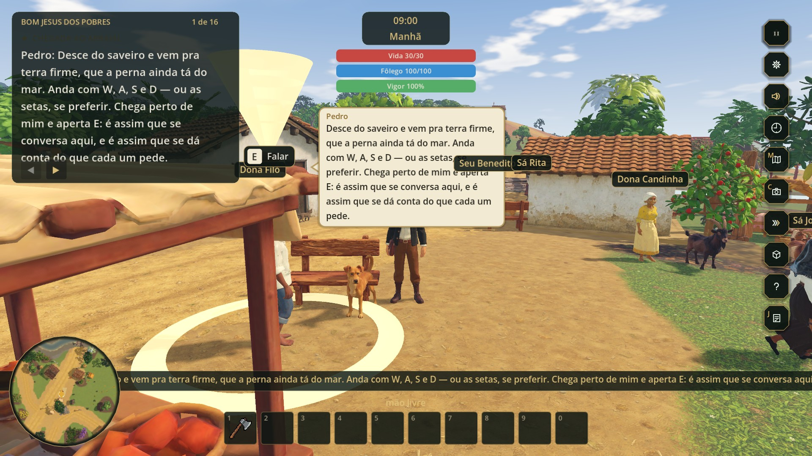
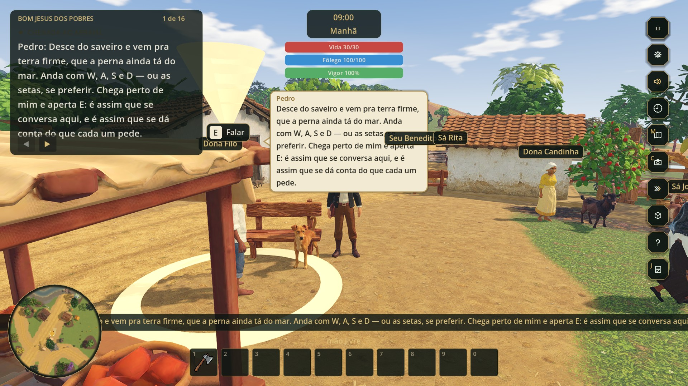

# Desempenho do vale 3D — investigação de 05/10/2026

**Pergunta:** por que o jogo cai de 60 para 15 FPS e por que os carregamentos estão tão lentos — e o que dá para fazer ainda hoje, antes da build.

**Estado:** investigação concluída, **nada foi implementado**. Nenhum arquivo do jogo foi alterado (commit `eb430e4`, `main`, árvore limpa antes e depois). Tudo o que aparece aqui como "com a correção" foi medido aplicando a mudança **só na memória do processo de medição**; o código do projeto está como estava.

**Como ler:** as seções 1 e 2 bastam para decidir. As seções 4 a 8 são a prova. Os dados brutos, as fotos antes/depois, o medidor e os oito relatórios por subsistema estão em [desempenho_05_10_2026/](desempenho_05_10_2026/LEIA-ME.md).

---

## 1. Veredito em uma página

### O que foi medido (notebook do autor, tela cheia 1920×1080, estilo Tripo)

| Medida | Valor |
|---|---|
| FPS em 128 vistas do vale (16 lugares × 8 rumos de câmera) | mínimo **5,3** · mediana **13,4** · máximo **30,1** |
| Vistas abaixo de 15 FPS / abaixo de 30 FPS | **81 de 128** / **127 de 128** |
| Triângulos desenhados por quadro | 1,9 a **8,9 milhões** (mediana 5,75 M) |
| Tempo de GPU por quadro (só a tela) | 23 a 107 ms (mediana 60 ms; 60 FPS pediriam 16,6 ms) |
| Scripts de física (`_physics_process`), por tick de 1/60 s | 2,4 a **22 ms** (o orçamento inteiro de um tick é 16,6 ms) |
| Carregamento, do idioma até poder andar | **≈ 95 a 99 s**: 46–48 s até o menu + 49–51 s depois do JOGAR |
| Maior congelamento durante a carga | **19 a 20 s num único quadro** (etapa "Estendendo a praia e os rios"), duas vezes |

O vale **nunca chega a 60 FPS** nesta máquina, em nenhum lugar e para nenhum lado. O "60" que aparece no histórico é de medições antigas, em cenas mais leves e janelas menores; em 30/09 o próprio projeto já registrava 20 a 33 FPS com o LOD ligado, numa janela de 1024×576 e com o minimapa desligado (`docs/mundo/VALE_VIVO_3D.md:157-165`). A queda nasceu entre 26 e 28/09, quando a mata triplicou e ganhou espécies pesadas; a tela cheia em 1080p (04/10) e as novidades de 05/10 empurraram de "vinte e poucos" para "dez e poucos", e em dois lugares para 5 (seção 7).

### As causas, em ordem de peso (todas medidas)

1. **Triângulos demais na tela, quase todos de vegetação.** A mata, o sub-bosque e o paisagismo somam 17.601 instâncias e **46,7 milhões de triângulos**; o corte por distância (280 u) cobre praticamente o vale inteiro e o LOD automático das malhas quase não existe. O tempo de GPU acompanha os triângulos quase em linha reta (≈ 10 ms por milhão). Esconder a vegetação devolve **37 ms** por quadro.
2. **Todo modelo do Tripo é desenhado dos dois lados.** Os 262 GLBs vêm com `doubleSided`; o Godot desliga o descarte de faces de trás. Religar o descarte devolve **14 a 18 ms** e nas fotos não muda nada.
3. **A sombra do sol redesenha 3,7 milhões de triângulos por quadro** (4 cascatas até 180 u sobre ~760 malhas individuais): **11 a 13 ms**.
4. **Os scripts de física custam até 22 ms por tick e entram em espiral.** Com o quadro lento, o Godot roda até 8 ticks por quadro para "alcançar o relógio"; na praça isso dá 130 a 180 ms de script por quadro, e o jogo afunda para 5 FPS mesmo com a GPU folgada. Os responsáveis: `bicho_de_casa.gd`, `fauna_vale.gd` (cardumes), `npc.gd` e `espuma_agua.gd`.
5. **O minimapa desenha o mundo 3D de novo, todo quadro** (7 a 12 ms de GPU próprios; ≈ 4 ms de ganho líquido ao parar).
6. **MSAA 2x em 1080p**: 8 a 10 ms. Baixar a resolução ajuda pouco (o gargalo é geometria, não pixel).
7. **Não há descarte por oclusão.** Dentro da igreja, olhando para a parede, o jogo desenha 8,9 M de triângulos do vale que está atrás dela.
8. **A placa de vídeo do notebook está limitada pelo sistema** (seção 4.7): a 100 % de uso ela opera a 17 W de um total de 60 W, em estado de energia P5. Isso não é causa do jogo, mas multiplica todas as outras e vale 5 minutos de conferência **antes de qualquer decisão**.

### E o carregamento

1. **O vale inteiro é montado duas vezes**: uma atrás do menu (para o sobrevoo) e outra ao clicar JOGAR.
2. **Um defeito de cache refaz uma grade 23 mil vezes** e congela a tela 19 s por montagem. Corrigir é uma função de ~10 linhas, com resultado idêntico; medido: **montagem de 48 s para 32 s**.
3. O terreno (malha + colisão) é gerado em GDScript a cada carga: 11 a 12 s.
4. Depois de a barra chegar a 100 % ainda há **8 a 12 s** de trabalho, com uma travada de 7,9 s (moradores, bichos, interiores, navegação).

### O que dá para ganhar hoje (simulado no vale inteiro, sem tocar no projeto)

| Conjunto | FPS mínimo | FPS mediana | FPS máximo | Montagem do vale |
|---|---:|---:|---:|---:|
| Hoje | 5,3 | 13,4 | 30,1 | 48 s |
| **Pacote 1** — não muda o visual de forma perceptível (cache da costa, teto de 3 ticks, minimapa a 6 Hz, sem MSAA + FXAA, sombra a 60 u) | 10,6 | **18,5** | 41,6 | 33 s |
| **Pacote 2** — Pacote 1 + descarte de faces de trás + distâncias da mata × 0,5 | 10,6 | **26,4** | 42,9 | 33 s |

O Pacote 2 **dobra o FPS** em praticamente todos os lugares (praça: de 5 para 20; igreja: de 10 para 23) e as fotos lado a lado quase não mostram diferença. **Nenhum pacote de hoje leva a 60 FPS nesta máquina no estado em que ela está**: isso pede a placa sem o limite de energia ou as obras estruturais da seção 9.3 (modelos de árvore realmente leves, oclusão, física com menos consultas).

---

## 2. O que decidir hoje

| # | Decisão | O que se sabe | Recomendação |
|---|---|---|---|
| 1 | Conferir o modo de energia do notebook antes de julgar o FPS | GPU presa em P5, 17 W de 60 W, com "SW Power Cap" e "SW Thermal Slowdown" ativos a 66–69 °C, desde que a máquina ligou (seção 4.7) | **Fazer primeiro (5 min).** Se a placa voltar a P0, todos os números de GPU deste relatório melhoram, sem mexer no jogo. A máquina da banca e a do Demo Day também precisam disso conferido |
| 2 | Corrigir o cache da grade da costa | −16 s por montagem (−32 s no caminho menu → jogo), resultado idêntico, ~10 linhas | **Sim, hoje.** É a correção de melhor razão ganho/risco de todo o levantamento |
| 3 | Cortar a espiral de física (`max_physics_steps_per_frame = 3`) | Praça de 5 para ~13 FPS no Pacote 1. Abaixo de 20 FPS o jogo passa a andar em câmera lenta em vez de travar | **Sim, hoje** (1 linha no `project.godot`) |
| 4 | Minimapa a 6–10 Hz | −4 ms líquidos; quase igual à vista (andando, o mapa se desloca 1 a 2 px por atualização; correndo, 3 a 5) | **Sim, hoje** |
| 5 | Descartar faces de trás nos modelos do Tripo | −14 a −18 ms (16 a 21 % do quadro pesado). Sem diferença nas 3 vistas fotografadas | **Sim, com volta visual** em peças finas (varal, vela do saveiro, cerca, folhas de palmeira) antes de fechar a build |
| 6 | Encurtar o alcance da vegetação | × 0,7: −10 ms · × 0,5: −21 ms · × 0,35: −27 ms. A copa low-poly entra mais perto | **× 0,5 se a volta visual aprovar; × 0,7 se a copa de longe incomodar** |
| 7 | Trocar MSAA 2x por FXAA | −8 a −10 ms; bordas um pouco mais macias | Sim, ou virar opção em AJUSTAR (estrutural pequeno) |
| 8 | Sombra do sol de 180 u para 60–90 u e atlas 2048 | −4 a −6 ms somados | Sim |
| 9 | Segurar a tela de carregamento até o vale terminar de verdade | Esconde a travada de 8–12 s depois do 100 % (não reduz o tempo) | Sim, se sobrar 1 hora |
| 10 | Montar o vale uma vez só (reaproveitar o do menu) | −40 a −50 s no JOGAR | **Não hoje** (risco médio, meio dia de trabalho). Primeira obra depois da entrega |

Com as decisões 2 a 8, a expectativa honesta para a build de hoje **nesta máquina, com a placa limitada**, é mediana de ~26 FPS e pior caso de ~20 FPS a 1080p, e ~65 s de carga em vez de ~97 s. É jogável; não é 60.

---

## 3. Como foi medido

**Máquina:** Dell G3 3590 · i7-9750H (6 núcleos, turbo ativo: ~3,7–4,0 GHz medidos durante o jogo) · GeForce GTX 1660 Ti Max-Q 6 GB (driver 581.29) · 32 GB de RAM · SSD · Windows 10 · tela 1920×1080 · na tomada, plano "Equilibrado" com o controle do Windows em "Melhor desempenho".

**Jogo:** Godot 4.7.2, Forward+ (Vulkan), commit `eb430e4`, estilo Tripo, tela cheia 1920×1080, MSAA 2x — a configuração do autor. Rodado pelo binário do editor com `--path`, como faz o `JOGAR_3D.cmd`. O editor do Godot ficou aberto ao lado, como no uso normal.

**Perfil:** isolado (variável `APPDATA`, como faz o `testar.ps1`), com cópia dos caches de shader do perfil real. Saves e preferências do autor não foram tocados.

**Ferramentas:**

- `tools/prototipo_3d/medir_carregamento.gd`, que o projeto já tinha, para as etapas da carga (com janela, não `--headless`).
- Um medidor escrito para esta investigação ([medir_fps.gd](desempenho_05_10_2026/ferramentas/medir_fps.gd)), que sobe o vale como o jogo e:
  - põe o jogador em 16 lugares do `Lugares` e gira a câmera dele em 8 rumos, medindo cada vista;
  - **decompõe o quadro** com carimbos de tempo: scripts de física, passo do servidor de física, scripts de `_process`, e o tempo de desenho na CPU e na GPU que o `RenderingServer` informa, da tela e de cada `SubViewport`;
  - faz **testes A/B**: liga e desliga uma coisa de cada vez (uma propriedade, um grupo de nós, um script), sempre intercalando com a base para descontar a deriva, e diz quantos milissegundos cada uma custa;
  - aplica **pacotes de correção só na memória** e repete a volta pelo vale;
  - tira fotos da mesma vista com e sem cada ajuste.
- `nvidia-smi` para o estado da placa, lido durante as rodadas.
- Oito investigadores leram o código por subsistema (somente leitura); os relatórios deles estão no anexo e são citados aqui pelos identificadores (`VIV-01`, `VEG-02`, `CAR-04`...).

**Condições das medidas de FPS:** V-Sync desligado (para ver o tempo real do quadro), relógio do jogo andando na velocidade das preferências do autor ("Rápida"), 9 h da manhã, áudio mudo. Com V-Sync ligado a mesma vista dá o mesmo resultado (10,9 contra 11,3 FPS).

**Repetibilidade:** uma segunda rodada sem nenhuma mudança reproduziu a primeira (praça 4,8 contra 5,3 FPS; igreja 10,1 contra 10,1; mirante 9,1 contra 9,1).

---

## 4. Evidências de FPS

### 4.1 O vale inteiro: 128 vistas

Pior, mediana e melhor FPS entre os 8 rumos de câmera em cada lugar, hoje:

| Lugar | FPS pior | FPS mediana | FPS melhor | GPU na pior vista (ms) | Triângulos na pior vista | Scripts de física (ms por tick, mediana) |
|---|---:|---:|---:|---:|---:|---:|
| Píer | 10,2 | 17,6 | 30,1 | 77 | 7,9 M | 8,3 |
| **Praça** | **5,3** | **6,4** | 9,4 | 39 | 4,7 M | **17,2** |
| Igreja (por dentro) | 10,1 | 15,1 | 23,5 | 88 | 8,9 M | 7,1 |
| Venda | 10,9 | 17,0 | 28,3 | 82 | 8,4 M | 4,8 |
| Casa de taipa | 10,5 | 16,4 | 23,8 | 80 | 8,1 M | 4,1 |
| Lavoura | 9,8 | 14,1 | 20,3 | 89 | 7,7 M | 4,8 |
| Roçado | 10,7 | 16,4 | 23,6 | 79 | 8,2 M | 4,6 |
| Fogueira | 9,5 | 15,4 | 21,3 | 93 | 8,1 M | 5,9 |
| Mirante | 9,1 | 12,8 | 16,1 | 97 | 8,6 M | 2,6 |
| Cemitério | 9,6 | 12,6 | 17,9 | 93 | 7,7 M | 3,8 |
| Ponte da vila | 10,3 | 12,7 | 17,9 | 86 | 6,7 M | 3,7 |
| Terreiro | 9,5 | 11,6 | 14,8 | 90 | 7,6 M | 5,1 |
| Gameleira | 10,3 | 17,4 | 28,5 | 86 | 7,4 M | 7,6 |
| Chapada | 10,0 | 13,9 | 18,6 | 87 | 7,1 M | 3,8 |
| Portão da fazenda | 10,1 | 19,0 | 24,5 | 87 | 7,9 M | 3,8 |
| **Casa da estrada** | **6,0** | **6,7** | 9,9 | 89 | 7,3 M | **16,8** |

Duas leituras:

- **Em 14 dos 16 lugares o limite é a placa de vídeo**: a pior vista de cada um tem 7 a 9 milhões de triângulos e 77 a 97 ms de GPU. Olhando para o mar ou para um campo aberto (2 M de triângulos) o mesmo lugar dá 28–30 FPS.
- **Na praça e na casa da estrada o limite é a CPU**: a GPU está folgada (39 ms na pior vista da praça) e mesmo assim o jogo fica em 5–6 FPS, porque os scripts de física passam de 16 ms por tick (seção 4.5).

O tempo de GPU segue os triângulos: nas 128 vistas a correlação é 0,91 e a reta é **GPU ≈ 3,6 ms + 10,3 ms por milhão de triângulos**.

### 4.2 De onde vem o tempo de um quadro

Oito vistas, do pior ao melhor caso. "Passos" é quantos ticks de física o Godot rodou naquele quadro.

| Vista (lugar, rumo) | FPS | Quadro (ms) | GPU tela (ms) | GPU minimapa (ms) | Scripts de física: ms no quadro (passos × ms por tick) | Scripts de `_process` (ms) | Desenho na CPU (ms) | Triângulos | Draw calls |
|---|---:|---:|---:|---:|---|---:|---:|---:|---:|
| Praça 270° | 5,3 | 190 | 39 | 12 | **178** (8,0 × 22,3) | 3,5 | 2,0 | 4,7 M | 950 |
| Casa da estrada 135° | 6,0 | 167 | 89 | 16 | **146** (8,0 × 18,2) | 3,5 | 2,1 | 7,3 M | 942 |
| Mirante 270° | 9,1 | 109 | **97** | 10 | 16 (6,6 × 2,5) | 2,3 | 3,2 | 8,6 M | 1.133 |
| Lavoura 90° | 9,8 | 103 | **89** | 11 | 25 (6,1 × 4,0) | 3,1 | 3,0 | 7,7 M | 1.701 |
| Igreja 90° (interior) | 10,1 | 99 | **88** | 8 | 39 (5,9 × 6,6) | 2,2 | 3,4 | 8,9 M | 1.944 |
| Píer 45° | 10,2 | 98 | **77** | 11 | 78 (5,6 × 13,8) | 3,3 | 2,6 | 7,9 M | 1.267 |
| Venda 225° | 28,3 | 35 | 25 | 8 | 10 (2,1 × 4,9) | 2,7 | 1,7 | 2,2 M | 321 |
| Píer 270° | 30,1 | 33 | 23 | 7 | 17 (2,0 × 8,7) | 3,8 | 1,5 | 1,9 M | 266 |

O que **não** pesa: os scripts de `_process` (2 a 4 ms), o desenho na CPU (1 a 3,5 ms, mesmo com 2.000 draw calls), o servidor de física (1 a 3 ms), o HUD.

### 4.3 O que há na cena

Censo do vale pronto (5.846 nós):

| Item | Quantidade |
|---|---|
| Vegetação em `MultiMeshInstance3D` | 1.864 blocos · **17.601 instâncias · 46,7 M de triângulos** no nível mais detalhado |
| `MeshInstance3D` individuais | 834 · 2,94 M de triângulos · **758 projetam sombra** · só 72 têm corte por distância |
| Com esqueleto | 52 malhas · 480 mil triângulos · 52 esqueletos · 2.415 ossos · 51 `AnimationPlayer` (34 tocando) |
| Corpos de física | 49 `CharacterBody3D` · 354 `StaticBody3D` · 442 formas (26 trimesh com 274 mil faces) |
| Luzes | Sol com sombra (4 cascatas, 180 u) · Lua sem sombra · 27 luzes locais (22 omni + 5 spot), nenhuma com sombra |
| `SubViewport` | Minimapa 170×170, **`UPDATE_ALWAYS`, no mesmo mundo do vale** · boneco da mochila (parado com a mochila fechada) · estúdio de retrato (some depois das fotos) |
| Scripts com `_physics_process` | `cardume.gd` ×37 · `espuma_agua.gd` ×24 · `bicho_de_casa.gd` ×22 · `cadeia_de_missoes.gd` ×22 · `npc.gd` ×22 · `criatura_vale.gd` ×2 · e um de cada: `fauna_vale`, `canoas`, `tubarao`, `guia_pedro`, `luta_vale`, `vida`, `player_controller` |
| Scripts com `_process` | `animador_bicho.gd` ×74 · `authored_animator.gd` ×25 · `balao_fala.gd` ×23 · `bando_de_chao.gd` ×10 · mais ~40 nós de um script cada |
| Memória de vídeo do jogo | 1,82 GB (1,62 GB de textura). Com o editor e outros programas, 3,1 de 6 GB em uso: **não falta VRAM** |
| Ambiente | Céu por shader próprio (tempo real, radiância 256), névoa com perspectiva aérea, tonemap fílmico. **Nenhum efeito de tela** (sem SSAO, SSR, SDFGI, glow, névoa volumétrica) |

As camadas de vegetação mais pesadas (triângulos no nível mais detalhado):

| Camada | Instâncias × triângulos por instância | Total | Corte (u) | Níveis de LOD na malha |
|---|---|---:|---:|---:|
| **Sub-bosque** | 2.026 × **7.442** | 15,1 M | 85 | 1 |
| Mata: jequitibá | 983 × 2.791 | 2,7 M | 280 | 1 |
| Paisagismo: bananeira "leve" | 521 × 5.219 | 2,7 M | 230 | 1 |
| Mata: jatobá | 1.199 × 2.151 | 2,6 M | 280 | **0** |
| Mata: jenipapeiro | 385 × 5.652 | 2,2 M | 280 | 1 |
| Mata: embaúba | 716 × 2.963 | 2,1 M | 280 | 1 |
| Mata: ipê amarelo | 326 × 5.612 | 1,8 M | 280 | **0** |
| Mata: massaranduba | 508 × 2.819 | 1,4 M | 280 | 1 |
| Mata: pau-brasil | 242 × 5.629 | 1,4 M | 280 | 1 |
| Mata: dendezeiro | 225 × 5.583 | 1,3 M | 280 | **0** |
| Manguezal | 34 × **18.079** | 0,6 M | 230 | 1 |
| Ingazeiros do rio | 25 × **16.886** | 0,4 M | 230 | 1 |
| Coqueiros da orla | 22 × **14.716** | 0,3 M | 250 | 1 |

A tabela completa (76 grupos) está em [dados/fps1_censo.txt](desempenho_05_10_2026/dados/fps1_censo.txt).

### 4.4 A/B de GPU: quanto custa cada coisa

Vista **dentro da igreja, olhando para a porta** (a pior em triângulos: 8,3 a 8,9 M), com os scripts congelados para o quadro depender só do desenho. Base: 11,1 a 11,6 FPS, 76 a 80 ms de GPU. "Ganho" é quanto o quadro encurta com a mudança.

| Mudança | Ganho (ms) | FPS | Triângulos |
|---|---:|---|---|
| **Toda a vegetação (MultiMesh) escondida** | **37,4** | 11,5 → 20,1 | 8,33 M → 5,61 M |
| **Todas as malhas individuais escondidas** | **32,7** | 11,5 → 18,4 | 8,31 M → 2,75 M |
| Distâncias de corte da mata × 0,35 (280 → 98 u) | 27,3 | 11,3 → 16,3 | 8,35 M → 6,51 M |
| Distâncias de corte da mata × 0,50 (280 → 140 u) | 21,4 | 11,3 → 15,0 | 8,36 M → 6,84 M |
| Escala 3D 0,50 (um quarto dos pixels) | 17,6 | 11,1 → 13,8 | igual |
| **Faces de trás descartadas em tudo** | **16,7** | 10,4 → 12,6 | igual |
| Escala 3D 0,67 | 13,4 | 11,2 → 13,1 | igual |
| **Sol sem sombra** | **13,4** | 11,2 → 13,2 | 8,35 M → **4,61 M** |
| Faces de trás descartadas só na vegetação | 12,0 | 10,5 → 12,0 | igual |
| Malhas individuais sem projetar sombra | 11,8 | 11,2 → 13,0 | 8,35 M → 4,63 M |
| Distâncias de corte da mata × 0,70 (280 → 196 u) | 10,4 | 11,2 → 12,7 | 8,42 M → 7,59 M |
| Escala 3D 0,77 | 9,1 | 11,1 → 12,4 | igual |
| **MSAA 3D desligado** | **8,9** | 11,1 → 12,3 | igual |
| Sem MSAA, com FXAA | 8,0 | 11,1 → 12,2 | igual |
| Luzes locais escondidas (as dos interiores) | 6,4 | 11,3 → 12,2 | igual |
| FSR1 a 0,77 | 5,9 | 11,1 → 11,9 | igual |
| Todas as peças GLB do catálogo escondidas (218) | 6,0 | 11,5 → 12,4 | 8,31 M → 6,65 M |
| `SubViewports` parados (minimapa) | 4,4 | 11,6 → 12,2 | 8,30 M → 7,29 M |
| Limiar de LOD de malha 8 px (hoje 1) | 4,4 | 11,0 → 11,6 | 8,47 M → 8,02 M |
| Sombra do sol até 60 u (hoje 180) | 3,6 | 11,3 → 11,8 | 8,35 M → 6,56 M |
| Terreno escondido | 2,8 | 11,6 → 12,0 | 8,30 M → 7,26 M |
| Sombra em 2 cascatas (hoje 4) | 2,6 | 11,3 → 11,7 | 8,35 M → 7,06 M |
| Mar escondido | 2,4 | 11,6 → 11,9 | igual |
| Atlas de sombra 2048 (hoje 4096) | 2,0 | 11,4 → 11,6 | igual |
| Malhas com esqueleto escondidas (51) | 1,7 | 11,5 → 11,7 | 8,31 M → 7,95 M |
| `lod_bias` 0,25 na vegetação (hoje 0,65) | 1,2 | 11,3 → 11,4 | quase igual |
| Céu trocado por cor sólida | 0,9 | 11,4 → 11,6 | igual |
| Névoa desligada | 0,5 | — | igual |
| Câmera com `far` 600 (hoje 2.800) | 0,3 | — | igual |
| `Label3D` escondidos (46) · partículas escondidas | 0,3 · 0,2 | — | — |
| Galinhas (25) · pintinhos (7) · gatos (4) escondidos | 0,5 · 0 · 0 | — | — |

Ao ar livre (lavoura, olhando para leste; base 10,6 FPS, 81 ms de GPU) os números se repetem:

| Mudança | Ganho (ms) |
|---|---:|
| Faces de trás descartadas em tudo | **16,3** |
| Faces de trás descartadas só na vegetação | 13,9 |
| Sol sem sombra | 11,1 |
| Malhas individuais sem projetar sombra | 8,1 |
| Sombra até 30 u · 2 cascatas · até 60 u · filtro duro · atlas 2048 | 3,5 · 2,9 · 2,4 · 2,1 · 2,1 |
| Peças pequenas sem sombra (239) · interiores sem sombra (222) · moradores, bichos e aves sem sombra (106) | 1,0 · 0,3 · 0,2 |

O que esta tabela prova:

- **O gargalo é geometria, não pixel.** Com um quarto dos pixels (escala 0,5) o quadro ainda leva 62 ms de GPU.
- **Vegetação (37 ms) e malhas individuais (33 ms) dividem o quadro pesado**; dentro das individuais, a sombra é o maior pedaço (12 ms) e vem das peças grandes — casas, árvores nomeadas, terreno e fitas —, não dos bichos nem das peças pequenas.
- **O céu, a névoa, o terreno de 8 camadas e o mar** — as novidades de 05/10 que parecem caras no código — custam pouco (0,5 a 2,8 ms cada). O céu está no melhor modo: trocar para `QUALITY` piora 14 ms.
- **Bichos e moradores não pesam na GPU** (1,7 ms as 51 malhas com esqueleto). O peso deles é de CPU.
- **O LOD automático de malha quase não atua**: nem `lod_bias` nem o limiar em pixels movem o ponteiro.

### 4.5 A/B de CPU: a física e a espiral

Na praça (olhando para oeste), como se joga: 5,2 FPS, 160 ms de scripts de física por quadro em 8,0 ticks. Desligando um script de cada vez:

| Script desligado | Scripts de física, ms por tick (antes → depois) | FPS (antes → depois) |
|---|---|---|
| **Todos os que têm `_physics_process`** | 16,9 → **0,1** | 6,6 → 17,9 |
| `bicho_de_casa.gd` (22 nós) | 18,2 → 11,4 (**−6,8**) | 6,4 → 15,7 |
| `fauna_vale.gd` (1 nó, comanda os cardumes) | 17,8 → 11,3 (**−6,5**) | 5,9 → 17,1 |
| `npc.gd` (22 nós) | 16,5 → 13,2 (**−3,3**) | 6,7 → 13,2 |
| `espuma_agua.gd` (24 nós) | 22,1 → 19,6 (−2,5) | 5,3 → 5,9 |
| `cardume.gd` (37 nós) | 19,1 → 17,7 (−1,4) | 5,8 → 6,2 |
| `cadeia_de_missoes.gd`, `criatura_vale.gd`, `canoas.gd`, `tubarao.gd`, `guia_pedro.gd`, `player_controller.gd`, `vida.gd`, `luta_vale.gd` | dentro do ruído | — |
| `AnimationPlayer` parados (51) | 16,2 → 15,4 | 6,8 → 7,3 |
| Relógio do dia parado | sem efeito | — |
| Servidor de física 3D inativo | sem ganho | — |

O mecanismo da **espiral**: a física roda a 60 Hz fixos. Quando um quadro demora 66 ms, o Godot roda 4 ticks seguidos antes do próximo desenho; se cada tick custa mais que 16,6 ms, ele nunca alcança o relógio e roda o teto de 8 ticks por quadro (padrão de `physics/common/max_physics_steps_per_frame`, que o `project.godot` não altera). Na praça: 8 × 17 a 22 ms = 130 a 180 ms por quadro. O quadro lento faz a física pesar mais, que deixa o quadro mais lento.

O custo por tick depende de onde o jogador está, porque os bichos, os moradores e os cardumes só trabalham de verdade perto dele: 2,5 ms no mirante, 4 a 8 ms na maior parte do vale, **14 a 22 ms no píer, na praça e na casa da estrada**. O que esses quatro scripts têm em comum são as consultas de terreno e de água em GDScript (`ground_height_at`, `water_depth_at`, `water_level_at`) a cada tick e por indivíduo, e o `move_and_slide` contra a malha do terreno. Os detalhes, linha a linha, estão em `VIV-01` a `VIV-13` do anexo.

Dois experimentos em memória:

- **Com o cache da costa corrigido** (seção 5.2), o tick na praça cai de 15–22 ms para 12–16 ms, e na casa da estrada de 14–18 para 9–14 ms. Ajuda, mas não resolve sozinho.
- **Com o teto de 3 ticks por quadro** (dentro do Pacote 1 da seção 8.3, que também traz o cache), a pior vista da praça sai de 5,3 para 12,7 FPS: o quadro volta a ser limitado pela GPU, como no resto do vale.

### 4.6 Hora do dia, V-Sync e um passeio

| Hora | 6 h | 9 h | 12 h | 15 h | 17h30 | 19 h | 21 h | 0 h |
|---|---:|---:|---:|---:|---:|---:|---:|---:|
| FPS (igreja, interior) | 11,2 | 11,3 | 11,4 | 11,4 | 11,7 | 13,7 | 13,3 | 13,3 |
| Triângulos | 8,8 M | 8,3 M | 7,4 M | 7,4 M | 7,5 M | 4,6 M | 4,6 M | 4,6 M |

À noite melhora pouco: o sol sai, a sombra dele some (por isso os triângulos caem à metade), e ainda assim o quadro fica em 13 FPS.

**Passeio** píer → praça → igreja → venda → casa → lavoura → roçado → mirante (85 s, 1.055 quadros, a 9 u/s): **12,5 FPS de média**, mediana de 80 ms por quadro, 95 % dos quadros abaixo de 131 ms, pior quadro de 354 ms; **93 % dos quadros passam de 50 ms**. A série completa está em [dados/fps2.json](desempenho_05_10_2026/dados/fps2.json) (`passeio.serie_ms`).

### 4.7 A placa do notebook está limitada pelo sistema

Leitura do `nvidia-smi` **com o jogo a 100 % de uso da GPU**:

| Leitura | Valor medido | Esperado em carga |
|---|---|---|
| Estado de desempenho | **P5** | P0 |
| Relógio do núcleo | **960 a 1.140 MHz** | até 2.100 MHz |
| Relógio da memória | **810 MHz** | até 6.001 MHz |
| Potência | **17 a 18 W** (175 amostras a ≥ 99 % de uso; máximo 18,1 W) | até 60 W |
| Limite de potência atual / padrão | **30 W** / 60 W | 60 W |
| "SW Power Cap" · "SW Thermal Slowdown" | **Ativo · Ativo** | inativos |
| Temperatura | 62 a 69 °C (alvo do driver: 87 °C) | — |
| Contadores de limitação | 29.802 s ≈ 8,3 h, isto é, **desde que a máquina ligou hoje** | — |

A placa não está quente e a CPU não está limitada (o processador roda a 140–155 % da frequência nominal). Alguma política de energia ou de temperatura do notebook está segurando a GeForce num estado baixo o tempo todo. Não consegui determinar qual; os candidatos, em ordem de probabilidade:

1. Perfil térmico do Dell em "Silencioso" ou "Frio" (BIOS → *Thermal Management*, ou Dell Power Manager / Alienware Command Center; nenhum desses programas está rodando agora). No G3 existe ainda a tecla **G** (F7, *Game Shift*), que liga o modo de desempenho quando o Command Center está instalado.
2. Fonte que o notebook não reconhece ou de potência menor que a original (o contador "HW Power Braking" também marca 8,3 h). O BIOS avisa isso ao ligar.
3. *Whisper Mode* ou *Battery Boost* no GeForce Experience; ou "Modo de gerenciamento de energia" diferente de "Preferir desempenho máximo" no painel da NVIDIA.

**Como conferir:** com o jogo aberto, rode `nvidia-smi -q -d PERFORMANCE,POWER`. Se depois do ajuste aparecer "Performance State: P0" e "SW Power Cap: Not Active", o limite saiu.

Por que isso importa para a decisão: todos os tempos de GPU deste relatório foram medidos com a placa nesse estado. Os custos **relativos** (o que pesa mais que o quê) continuam valendo; os FPS absolutos tendem a subir bastante com a placa solta. E a máquina da banca não é esta — por isso as correções do jogo continuam necessárias de qualquer forma.

---

## 5. Evidências de carregamento

Medido com a ferramenta do projeto, com janela, do clique no idioma em diante. "Frio" = perfil novo, sem cache de shader (primeira execução numa máquina); "quente" = com os caches do autor.

| Trecho | Frio | Quente |
|---|---:|---:|
| **Menu** (`abertura`): até o vale ficar pronto atrás do menu | 45,4 s | 43,0 s |
| Menu: total até o menu responder | 48,0 s | 45,7 s |
| **JOGAR** (`vale`): até o `pronto` do mundo | 39,6 s | 41,2 s |
| JOGAR: total até o jogo estabilizar | 51,3 s | 49,3 s |
| **Soma, do idioma até andar** | **≈ 99 s** | **≈ 95 s** |

O cache de shader quase não muda nada: **o tempo é CPU gerando o mundo em GDScript**, não disco nem compilação.

As etapas de uma montagem (as duas montagens são quase iguais):

| Etapa (texto da tela de carregamento) | Menu | JOGAR | Observação |
|---|---:|---:|---|
| **"Estendendo a praia e os rios"** | **19,3–19,6 s** | **19,0–20,3 s** | **um único quadro**: a tela congela |
| **"Moldando o terreno"** (malha e colisão) | 11,2–11,8 s | 10,8–11,0 s | cede quadros, com trechos de até 2,5 s sem ceder |
| "Abrindo as ruas" | 2,5–2,7 s | 2,4–3,0 s | |
| "Plantando a mata" (sorteio, malhas, sub-bosque) | 3,4–4,3 s | 1,5 s | a segunda vez aproveita caches |
| Vila (casas, árvores, píer, objetos, paisagismo) | ≈ 5 s | ≈ 1,8 s | a primeira vez lê os GLBs do disco |
| Leitura da cena em segundo plano | 1,4–1,5 s | 2,9–3,5 s | |
| **Depois do "Pronto"** (primeiros quadros com o vale à vista) | 2,6–2,7 s | **8,1–11,6 s** | no JOGAR: moradores, bichos, interiores, navegação; **uma travada de 7,9 s** e 2.681 nós criados |

### 5.1 O vale é montado duas vezes

`abertura.tscn` e `vale.tscn` têm, cada uma, um nó `Cenario` com `world_builder.gd`, que monta o mundo no `_ready` (`world_builder.gd:601-607`). O menu monta o vale inteiro para o sobrevoo; ao clicar JOGAR, a troca de cena joga esse mundo fora e monta outro igual. Só os caches estáticos do catálogo sobrevivem. Voltar ao menu ou trocar o estilo monta de novo. A preferência "sobrevoo" só liga e desliga o movimento da câmera: o mundo do menu é montado de qualquer jeito.

### 5.2 O defeito do cache da grade da costa (a correção mais barata do relatório)

`GeoRegionRenderer._distancia_costa(ponto, margem)` (`geo_region_renderer.gd:2645-2668`) guarda **uma** grade de segmentos da costa e a refaz inteira sempre que a margem pedida muda (`:2646`). Desde 04/10 ela é chamada com margens diferentes (4, 6, 7, 20 e 26 u; chamadas em `:503`, `:544`, `:1461`, `:1562`, `:1988` e em `paisagismo_vale.gd:558`). Ao montar as fitas de rio e de foz, **cada vértice** pede a margem 4 ou 7 e em seguida a 20: são cerca de 23,6 mil reconstruções e 29 milhões de inserções em dicionário (`VEG-01`), tudo sem ceder quadro. É a etapa de 19 s.

**Experimento:** troquei, só na memória do medidor, a grade única por uma grade por margem (mesma conta, mesmo resultado). Em três rodadas, a montagem do vale passou de **48,1 e 50,3 s para 31,8, 33,1 e 33,2 s** (−16 s, −34 %). No caminho menu → jogo isso vale ~32 s.

O mesmo defeito cobra durante o jogo: toda consulta de água num ponto do rio central (o que passa entre a praça, a igreja e o píer) refaz a grade duas vezes (`VIV-01`). É parte do motivo de a praça ser o pior lugar de CPU.

### 5.3 O resto

- **Terreno:** `_add_polygon("Terra")` (`geo_region_renderer.gd:1026-1056`) triangula o polígono da terra, subdivide por recursão em GDScript (`:1068-1094`), solda, calcula normais e cria uma colisão trimesh com os 130.644 triângulos. É determinístico: sai igual toda vez e poderia vir pronto do disco.
- **Depois do 100 %:** a tela de carregamento sai quando o mundo avisa `pronto`, mas o `_ready` do `prototype.gd` ainda monta os interiores, a navegação, 23 moradores, ~100 bichos, peixes e telas (`prototype.gd:224-768`); cerca de 55 GLBs são lidos ali pela primeira vez, de forma síncrona (`CAR-04`, `VIV-04`, `HUD-03`).
- **Tamanho da build:** o cache de importação tem agora 1.066 MB de texturas e 88 MB de cenas (262 GLBs). O exe da build 7 tinha 516 MB com 96 GLBs; o próximo deve ficar em **≈ 1,2 a 1,3 GB** (`AST`, `CAR-06`). 40 GLBs usam texturas 2K (418 MB), inclusive itens que a regra do projeto manda ficar em 1K.

### 5.4 Achado de passagem: o cache de importação estava desatualizado

Às 15h52 minha primeira medição falhou: 8 texturas de chão (`grama_baixa_v1.png`, `pedrisco_v1.png`...) não tinham o arquivo importado, o `geo_region_renderer.gd` não compilou ("Could not preload resource file") e o `world_builder.gd` caiu junto — o vale não montava. O `.godot/imported` deste checkout tinha 463 texturas e 105 cenas; depois de o editor aberto importar o que chegou no merge das 15h12 (das 15h54 às 15h58), passou a ter **957 texturas e 262 cenas**. Ou seja: durante 40 minutos, quem rodasse o jogo desta pasta sem passar pelo editor ou pelo `JOGAR_3D.cmd` (que roda `--import` antes) não tinha jogo.

Para a build de hoje: **antes de exportar, abra o editor e espere a importação terminar** (ou rode `--headless --editor --import`), e confira no log que não há `Parse Error` nem `Failed loading resource`. Exportar com o cache pela metade gera um exe quebrado.

---

## 6. Causas, uma a uma

Cada item traz a evidência, o mecanismo, a correção proposta com o lugar no código, o esforço, o risco e o ganho medido. "Hoje" quer dizer que cabe antes da build; "depois" é obra estrutural.

### F1 — A vegetação é desenhada em resolução cheia até 280 u (crítico)

- **Evidência:** 46,7 M de triângulos de vegetação em cena; 37 ms de GPU ao escondê-la; reta de 10,3 ms por milhão de triângulos (seções 4.1 a 4.4). O raio de corte da mata, 280 u, tem 246 mil u², e a terra do vale tem 263 mil u²: o corte só tira árvores na serra do oeste (`VEG-02`). Da praça ficam 2.400 árvores dentro do raio; do mirante, 4.700.
- **Mecanismo:** sem níveis de LOD na malha, uma árvore a 200 u ocupa ~55 px de altura e ainda manda 2 a 6 mil triângulos. Triângulos menores que um pixel são o pior caso para a GPU, e cada um passa duas vezes pelo processamento de vértices (pré-passe de profundidade e passe de cor). O importador gerou 0 ou 1 nível de LOD nos modelos do Tripo (as costuras de UV travam o simplificador), e num `MultiMesh` o Godot escolhe o LOD para o bloco inteiro.
- **Hoje:** encurtar as constantes `LOD_RESTINGA`, `LOD_ARVORE_RIO`, `LOD_COQUEIRO` e `LOD_MATA` (`geo_region_renderer.gd:192-195`), a coluna `lod` de `data/paisagismo/receitas.json` e `LOD_DO_FORRO` (`paisagismo_vale.gd:41`). A copa distante acompanha sozinha (`_multimesh_em_blocos` repassa a distância, `:2174`).
- **Ganho medido:** × 0,7: −10 ms · × 0,5: −21 ms · × 0,35: −27 ms nas vistas pesadas.
- **Esforço:** 15 a 30 min, mais uma volta pelo vale e pelo sobrevoo do menu.
- **Risco:** visual. A copa de 64 triângulos passa a entrar a 140 u em vez de 280 u; o "estalo" da troca fica mais perto. Nas fotos da praça, da igreja e do mirante a diferença não aparece (seção 8). Portões a rodar: `tests/lod_vegetacao.gd`, `tests/ceu_horizonte.gd` (a regra da névoa cita os 280 u), `tests/mata_em_manchas.gd`, `tests/sobrevoo_livre*.gd`.
- **Depois:** LOD de verdade (modelos de 300 a 600 triângulos para o anel do meio, ou impostores); usar na orla e no rio os modelos `_leve` que já existem em vez dos completos de 14,7 a 18 mil triângulos (`VEG-05`); refazer o sub-bosque, que tem 7.442 triângulos por tufo e é a camada mais pesada (`VEG-06`); plantas de roça de 1,8 a 2,3 mil triângulos por pé (`VEG-07`, `MUN-01`).

### F2 — Todo modelo do Tripo é desenhado dos dois lados (alto)

- **Evidência:** os 262 GLBs têm `doubleSided: true` e `alphaMode: OPAQUE`; o importador vira isso em `cull_mode = CULL_DISABLED` (`AST-01`, `MUN-05`, `VEG-03`; o censo mostra `cull=2` em todos os grupos). Religando o descarte: −12 a −14 ms só na vegetação, **−16 a −18 ms em tudo**, dentro e fora de casa.
- **Mecanismo:** em malha fechada, metade dos triângulos está de costas para a câmera e é rasterizada à toa, em todas as passadas (profundidade, cor e as quatro cascatas de sombra).
- **Hoje:** aplicar `cull_mode = BaseMaterial3D.CULL_BACK` nos materiais quando o catálogo carrega ou instancia a peça (`catalogo_assets.gd:383-426`) e nos blocos de vegetação (`geo_region_renderer.gd:2155-2158`), com uma lista de exceções para o que precisar das duas faces. O `interiores.gd:428-436` já faz isso nas cascas de 4 casas.
- **Esforço:** ~1 hora, mais a volta visual.
- **Risco:** peça de casca aberta ou plano fino some de um lado: roupa no varal, vela do saveiro, cerca de varas, folha de palmeira, pano, pena. Nas fotos lado a lado do mirante (mangueiras, embaúbas, coqueiro, arbustos floridos, mirante de madeira), da praça e da igreja **não há diferença visível**. Nenhum portão cita `cull_mode`.

### F3 — A sombra do sol redesenha 3,7 M de triângulos por quadro (alto)

- **Evidência:** sol com `SHADOW_PARALLEL_4_SPLITS` e `directional_shadow_max_distance = 180` (`ceu_vale.gd:91-93`); 758 malhas individuais projetam sombra; desligar a sombra tira 3,74 M de triângulos e 1.000 draw calls do quadro e devolve 11 a 13 ms. A vegetação em bloco já não projeta sombra (correto). Por família: interiores −0,3 ms, bichos e moradores −0,2 ms, peças pequenas −1,0 ms — **o custo está nas peças grandes** (casas, árvores nomeadas de 10 a 20 mil triângulos) e no terreno e nas fitas, que projetam sombra nas 4 cascatas (`VEG-09`).
- **Hoje:** distância de 180 para 60–90 u (`ceu_vale.gd:92`) e atlas 2048 (`rendering/lights_and_shadows/directional_shadow/size`): −4 a −6 ms somados. Opcional: terreno, ruas e praia com `cast_shadow` desligado (chão plano quase não projeta sombra útil; não medi isolado).
- **Risco:** baixo. A sombra passa a existir só perto do jogador; a névoa cobre a transição.

### F4 — Scripts de física a 60 Hz, com espiral (crítico na praça e na casa da estrada)

- **Evidência:** seção 4.5.
- **Hoje, três medidas independentes:**
  1. **Cache da costa** (seção 5.2): tira parte do custo perto do rio central e 16 s de cada carga.
  2. **`physics/common/max_physics_steps_per_frame = 3`** no `project.godot` (seção nova `[physics]`): corta a espiral. Efeito colateral: abaixo de 20 FPS o tempo do jogo passa mais devagar que o relógio — hoje ele trava. Os portões que contam ticks usam `Engine.physics_ticks_per_second` e não mudam (`VIV-03`).
  3. **Remédios de 1 a 5 linhas** descritos pelos investigadores, se houver tempo: dar aos moradores o que os bichos já têm (`floor_snap_length = 0`, menos deslizes) e não chamar `move_and_slide` de quem está parado (`npc.gd:256`, `:417`; `VIV-02`); nado e espuma dos moradores a cada 4 ticks (`VIV-10`); o porco que refaz a lista de 6.300 árvores a cada decisão (`bicho_de_casa.gd:309-331`, `VIV-13`); o `AnimationPlayer` de bicho escondido que continua tocando (`animador_bicho.gd:305-324`, `VIV-07`).
- **Depois:** rumo dos peixes fora do GDScript ou a 30 Hz (`VIV-05`); bichos e moradores com simulação simplificada longe da câmera; física a 30 Hz com interpolação (arriscado hoje: a câmera está no `_process`).
- **Risco:** os remédios do item 3 mexem em comportamento; rodar `tests/rotina_dos_moradores.gd`, `festa_da_fe.gd`, `navegacao.gd`, `casas_dos_moradores.gd`, `bichos_de_casa.gd`, `fauna_do_mar.gd`.

### F5 — O minimapa desenha o vale de novo, todo quadro (médio)

- **Evidência:** `SubViewport` de 170×170 px, `own_world_3d = false`, `UPDATE_ALWAYS`, câmera ortográfica a 100 u (`minimapa.gd:94-106`, e `:144` reafirma o modo a cada quadro). O viewport gasta 7 a 12 ms de GPU por quadro; parar a atualização rende 4,4 ms líquidos (parte do trabalho, como a sombra, passa a ser cobrada da tela).
- **Hoje:** atualizar a 6–10 Hz (`UPDATE_ONCE` num temporizador). O desenho por cima (seta do jogador, alvo) continua por quadro. Andando, o mapa se desloca 1 a 2 px por atualização; correndo a 9 u/s, 3 a 5 px.
- **Esforço:** ~10 linhas. **Risco:** baixo.
- **Depois:** textura do mapa assada uma vez.

### F6 — 1080p com MSAA 2x e nenhuma opção de qualidade (médio)

- **Evidência:** MSAA desligado −9 ms; escala 3D 0,77 −9 ms; 0,67 −13 ms; FSR1 0,77 −6 ms. O jogador não tem nenhuma opção de qualidade gráfica; a única escolha do AJUSTAR que alivia a placa é esconder o minimapa (`painel_ajustes.gd:261-268`), que já rende os ~4 ms de F5.
- **Hoje:** `rendering/anti_aliasing/quality/msaa_3d=0` e `screen_space_aa=1` (FXAA) no `project.godot:97`. Se ainda faltar, `rendering/scaling_3d/mode=1` (FSR1) com `scale=0.77`.
- **Risco:** imagem um pouco mais macia. A interface não é afetada.
- **Depois:** um seletor "Qualidade gráfica" (Alta / Média / Baixa) em AJUSTAR, que é o que protege o jogo em máquinas que não conhecemos.

### F7 — Sem oclusão: dentro de casa o vale inteiro continua sendo desenhado (médio)

- **Evidência:** a "vista da igreja" das medições é **dentro da igreja**. Olhando para a parede e a porta, o quadro tem 8,9 M de triângulos e 88 ms de GPU; a vegetação, que não aparece, custa 37 ms. Dentro da casa do jogador, com a câmera de cima, são 4,6 M de triângulos e 24 FPS. O projeto não tem nenhum `OccluderInstance3D` e o descarte por oclusão está desligado. As 27 luzes dos interiores ficam sempre acesas: 6,4 ms na igreja.
- **Hoje (opcional):** ao entrar numa construção (sinal `interiores.entrou`, `prototype.gd:714`), encurtar o alcance da vegetação — é o mesmo mecanismo que o renderizador já usa para o mapa (`_atualizar_lod_da_camera`, `geo_region_renderer.gd:2440-2453`).
- **Depois:** caixas de oclusão nas construções e `rendering/occlusion_culling/use_occlusion_culling`.

### F8 — A placa do notebook está limitada (ambiente)

Seção 4.7. Não é defeito do jogo, mas decide quanto do resto é urgente.

### F9 — A regressão entrou sem alarme (processo)

- **Evidência:** nenhum portão de `tests/` mede FPS, triângulos por quadro, draw calls, tempo de GPU ou tempo de carga. O único orçamento que existe, o do paisagismo, aceita 14.000 pés e **45 milhões de triângulos** (`tests/paisagismo.gd:36-37`, `MUN-15`) — o vale inteiro tem 46,7 M. `tools/prototipo_3d/medir_lod.gd`, de onde vieram os números antigos, mede a 1024×576, com o minimapa desligado e o jogador parado (`HUD-05`).
- **Depois:** um portão de orçamento com janela (triângulos por quadro em 3 vistas fixas e tempo de montagem), reaproveitando o medidor desta investigação.

### C1 — O vale montado duas vezes (crítico no carregamento)

Seção 5.1. **Depois:** em `abertura._start_game` (`abertura.gd:1838-1853`), instanciar `vale.tscn` à mão e adotar o `Cenario` já pronto do menu em vez de montar outro; o `prototype.gd:229-234` já trata `world.construido == true`. Cuidados: o `Lugares` precisa ser registrado de novo depois do `reparent` (`world_builder.gd:667-668`), e vários portões passam por abertura → vale (`CAR-01`). Meio dia a um dia, risco médio. Não recomendo para hoje.

### C2 — O cache da grade da costa (crítico, correção trivial)

Seção 5.2. **Hoje.** `geo_region_renderer.gd:2645-2657`: guardar um dicionário de grades com a margem como chave, limpo quando `_coast.size()` muda. Os portões `tests/paisagismo.gd:373` e `:503` chamam a função direto e continuam válidos. 15 a 30 min, risco muito baixo.

### C3 — Terreno gerado em GDScript a cada carga (alto)

Seção 5.3. **Depois:** assar a malha e a colisão em um `.res` por uma ferramenta de editor; `tools/mapas/gerar_terreno_editavel.gd` já mostra o caminho (`CAR-03`). Um dia de trabalho. Vale 11 s por montagem.

### C4 — Trabalho pesado depois do 100 % (alto na percepção)

Seção 5.3. **Hoje, se houver 1 a 2 horas:** um sinal no fim do `_ready` do `prototype.gd` e a `tela_carregamento.gd:489-511` esperando por ele (com teto), mais 3 ou 4 quadros com o mundo visível por baixo da tela opaca para os shaders compilarem escondidos (`CAR-04`, `CAR-05`). Não reduz o tempo; troca "terminou e congelou" por uma barra que termina quando acabou.

### C5 — Blocos que não cedem quadro (médio)

A etapa de 19 s some com C2. Restam trechos de 0,5 a 2,5 s sem ceder (terreno, sorteio da mata, paisagismo): a tela para de animar, e em máquina lenta o Windows pode marcar a janela como "não respondendo". `await` entre as subetapas (`CAR-09`).

### C6 — A build vai sair com ~1,2 a 1,3 GB (médio)

Seção 5.3. **Hoje, barato:** `exclude_filter` do preset para `assets/prototipo_3d/personagem/*` (modelo 4K que só uma ferramenta usa, 20 MB). **Decisão de arte, não de hoje:** 2K → 1K nos 40 GLBs fora da regra economiza ~310 MB.

### C7 — Primeira execução na máquina da banca

Não medi o exe exportado (seção 11). O que se sabe: os caches de shader e de pipeline começam vazios; o mundo fica invisível durante a montagem e todos os pipelines do vale compilam no primeiro quadro visível (`CAR-05`, `REN-11`). Se o preset de exportação do 4.7.2 oferecer o *Shader Baker*, ligar e testar. E testar o exe uma vez num perfil limpo antes de enviar.

---

## 7. "O LOD que implementamos se manteve?"

**Sim. Está ligado, funcionando, e as novidades passam por ele.** O que mudou foi o tamanho da conta.

| Otimização antiga | Estado em `eb430e4` | Evidência |
|---|---|---|
| Vegetação em `MultiMesh` por blocos de 40 u | **Mantida** | 1.864 blocos; `BLOCO_MATA = 40` (`geo_region_renderer.gd:187`) |
| Corte por distância (`visibility_range_end`) | **Mantida** | 1.056 blocos com corte: sub-bosque 85 u, restinga 200, rio 230, coqueiros 250, mata 280 (`:191-195`) |
| Paisagismo novo (04–05/10) pelo mesmo sistema | **Sim** | os grupos "Paisagismo: …" aparecem no censo com corte de 90 a 230 u |
| Copas distantes (64 triângulos até 1.200 u) | **Mantida** | ~700 blocos de copa, entrando onde a árvore sai |
| Modelos `_longe` do Tripo (280 a 600 u) | **Mantida** | grupos "Copa distante, modelo: …" no censo |
| Vegetação sem sombra | **Mantida** | `cast_shadow = OFF` em todos os blocos (`:2158`); confirmado no A/B (0 ms) |
| Exceção do mapa (câmera ortográfica mostra tudo) | **Mantida** | `_atualizar_lod_da_camera` (`:2440-2453`) |
| Texturas comprimidas em VRAM | **Mantida** | 871 de 953 texturas em modo VRAM; 1,62 GB em uso de 6 GB |
| Montagem cedendo quadros (80 ms) | **Mantida, com um buraco** | a etapa de 19 s não cede (C2) |
| "Vale em cinco segundos" (02/10, medido sem janela) | **Regrediu** | hoje 40 a 45 s com janela; o defeito do cache da costa entrou em 04/10 (commit `8413ae7`, segundo `VIV-01`) e sozinho responde por 19 s |
| LOD automático de malha (`lod_bias` 0,65) | **Ligado, sem efeito** | os modelos têm 0 ou 1 nível; mexer no `lod_bias` muda 1,2 ms |

Há um furo parcial: as versões `_leve` das árvores valem para a mata e para o paisagismo, mas **a orla, o manguezal, os ingazeiros do rio e a restinga continuam plantando os modelos completos** de 11 a 18 mil triângulos (`geo_region_renderer.gd:2045-2046`, `:2207`, `:2223`), e o sub-bosque nunca teve versão leve.

Por que o LOD não basta — a linha do tempo, resumida de `historico.md`:

| Data | O que mudou | Consequência |
|---|---|---|
| 26/09 | **A medição de 60 FPS**: janela de 1280×720, 1.800 árvores, 69 GLBs, 7 moradores, nenhum bicho, sem minimapa; 2,4 a 3,6 M de triângulos no quadro | É a linha de base que o histórico guarda — de um vale que não existe mais |
| 26–27/09 | A mata vai de 1.800 para 6.234 árvores (`tree_count`) | 3,5 vezes a vegetação, logo depois da medição |
| 28/09 | Entram as espécies pesadas da mata, o manguezal, o ingá, a restinga e o sub-bosque de 7.442 triângulos por tufo (`a0638d7`) | O quadro passa de 10 M de triângulos |
| 30/09 | LOD por distância (`015c01c`). Medição do próprio projeto: **20 a 33 FPS a 1024×576**, minimapa desligado, jogo parado | O LOD segura, mas já não são 60 |
| 04/10 | O jogo passa a abrir em tela cheia 1080p (`14c1b47`): 2,25 vezes os pixels de 720p. Entra o defeito do cache da costa (`8413ae7`) | Mais pixels; +19 s por carga |
| 05/10 | Moradores de 7 para 22, 71 bichos, ~50 cardumes, 2.000 pés de paisagismo, céu e chão novos; GLBs de 106 para 262 | Física por tick de até 22 ms; mais 7 M de triângulos de paisagismo |

As constantes de corte (85/200/230/250/280 u) são as mesmas desde 30/09: nada foi afrouxado. O corte continua cortando; só que dentro do raio agora cabem 8 milhões de triângulos. E as versões "leves" não são tão leves: o pedido ao Tripo foi de ~2.500 **faces** (quads), que no GLB viram 3,4 a 5,9 mil triângulos.

---

## 8. Pacotes simulados e fotos

### 8.1 A mesma vista, com cada ajuste (scripts congelados)

FPS e tempo de GPU em quatro vistas. Os pacotes A a D são combinações testadas no A/B:

- **A** = sem MSAA + FXAA + sombra a 60 u + atlas 2048
- **B** = A + minimapa parado + distâncias da mata × 0,5
- **C** = B + peças GLB com corte a 120 u + limiar de LOD 4 px + FSR1 0,77
- **D** = A + minimapa parado + mata × 0,35 + peças a 120 u + LOD 8 px + FSR1 0,67

| Vista | Base | Faces de trás | Mata × 0,5 | Mata × 0,35 | Sem MSAA + FXAA | Sombra 60 u | A | B | C | D |
|---|---:|---:|---:|---:|---:|---:|---:|---:|---:|---:|
| Igreja 90° (interior), FPS | 11,2 | 13,3 | 14,8 | 16,2 | 12,3 | 11,7 | 13,5 | 19,3 | 22,4 | **27,6** |
| — GPU (ms) | 79,0 | 65,1 | 57,0 | 51,4 | 70,7 | 74,7 | 64,2 | 50,0 | 42,4 | 34,4 |
| Praça 0°, FPS | 11,1 | 13,8 | 14,5 | 16,1 | 12,6 | 11,7 | 13,5 | 19,1 | 22,4 | **27,5** |
| — GPU (ms) | 76,2 | 60,0 | 54,8 | 48,9 | 65,4 | 71,0 | 60,7 | 50,2 | 42,5 | 34,3 |
| Mirante 270°, FPS | 10,2 | 12,6 | 13,4 | 15,2 | 11,2 | 10,3 | 11,4 | 16,2 | 19,3 | **24,1** |
| — GPU (ms) | 85,5 | 67,6 | 62,1 | 53,5 | 76,5 | 84,8 | 75,3 | 59,2 | 49,2 | 39,2 |
| Casa do jogador (interior, câmera de cima), FPS | 23,9 | 25,3 | 23,5 | 23,9 | 24,7 | 24,7 | 27,0 | 33,0 | 37,7 | **42,3** |

Mesmo o pacote mais agressivo fica em 24 a 28 FPS nas vistas pesadas **nesta máquina, com a placa limitada**.

### 8.2 O visual

Mirante, olhando para oeste. Base (10,2 FPS), faces de trás descartadas (12,6 FPS) e pacote D (24,1 FPS):







Praça, olhando para o norte. Base (11,1 FPS) e pacote C (22,4 FPS):





Nas cinco fotos o que muda é a nitidez (FXAA e FSR amaciam um pouco as bordas). Não aparecem buracos nos modelos com o descarte de faces, nem diferença na mata com as distâncias pela metade — nestas vistas, as árvores de perto escondem as de longe. A vista em que o corte mais apareceria é de um campo aberto olhando para a borda da mata, e o sobrevoo do menu: são as duas a conferir antes de fechar. O anexo traz 16 das 40 fotos tiradas (4 vistas × 10 variantes); as outras saem de novo com o medidor.

### 8.3 O vale inteiro com os pacotes aplicados (como se joga, scripts rodando)

Os dois pacotes incluem o cache da costa, o teto de 3 ticks e o minimapa a 6 Hz.

| Lugar | FPS pior: hoje → Pacote 1 → **Pacote 2** | FPS mediana: hoje → Pacote 1 → **Pacote 2** |
|---|---|---|
| Píer | 10,2 → 13,8 → **22,7** | 17,6 → 22,2 → **34,9** |
| Praça | 5,3 → 12,7 → **19,7** | 6,4 → 14,0 → **23,2** |
| Igreja | 10,1 → 12,3 → **22,9** | 15,1 → 18,8 → **26,9** |
| Venda | 10,9 → 13,5 → **24,9** | 17,0 → 21,4 → **30,8** |
| Casa de taipa | 10,5 → 13,2 → **24,3** | 16,4 → 21,4 → **29,8** |
| Lavoura | 9,8 → 11,9 → **22,2** | 14,1 → 18,3 → **25,1** |
| Roçado | 10,7 → 13,0 → **24,5** | 16,4 → 21,5 → **30,1** |
| Fogueira | 9,5 → 11,3 → **20,9** | 15,4 → 19,9 → **25,9** |
| Mirante | 9,1 → 10,6 → **19,9** | 12,8 → 15,4 → **25,9** |
| Cemitério | 9,6 → 11,3 → **22,9** | 12,6 → 16,1 → **25,6** |
| Ponte da vila | 10,3 → 12,4 → **22,8** | 12,7 → 16,2 → **24,2** |
| Terreiro | 9,5 → 11,4 → **23,6** | 11,6 → 14,4 → **26,7** |
| Gameleira | 10,3 → 12,4 → **22,0** | 17,4 → 22,7 → **31,8** |
| Chapada | 10,0 → 11,7 → **20,1** | 13,9 → 17,8 → **24,1** |
| Portão da fazenda | 10,1 → 12,1 → **19,4** | 19,0 → 24,8 → **30,1** |
| Casa da estrada | 6,0 → 12,8 → **10,6** | 6,7 → 25,2 → **21,0** |
| **Todas as 128 vistas** | **5,3 → 10,6 → 10,6** | **13,4 → 18,5 → 26,4** |

- **Pacote 1** = cache da costa + teto de 3 ticks + minimapa a 6 Hz + sem MSAA com FXAA + sombra a 60 u + atlas 2048.
- **Pacote 2** = Pacote 1 + faces de trás descartadas em todos os materiais + distâncias da mata × 0,5. (A rodada do Pacote 2 também apagou as luzes dos interiores; ao ar livre isso não muda nada, e dentro de casa não se faria.)
- Mediana de triângulos por quadro: 5,75 M → 4,19 M → 3,07 M. Mediana de ticks de física por quadro: 4,4 → 3,0 → 2,3.
- A casa da estrada continua sendo o pior ponto de CPU (13 ms por tick mesmo com o cache): é onde os remédios de F4.3 mais contam.

---

## 9. Plano proposto

### 9.0 Antes de tudo (5 min, sem código)

Conferir o modo de energia do notebook (seção 4.7) e repetir uma olhada no FPS do HUD. Se a placa sair do P5, refaça a conta do que é urgente.

### 9.1 Hoje — Bloco A: não muda o que o jogador vê

| Ação | Onde | Esforço | Ganho medido | Risco |
|---|---|---|---|---|
| A1. Grade da costa com cache por margem | `geo_region_renderer.gd:2645-2657` | 15–30 min | −16 s por montagem (−32 s até jogar); física −25 a −40 % por tick perto do rio central | Muito baixo: resultado idêntico |
| A2. Teto de 3 ticks de física por quadro | `project.godot`, `[physics] common/max_physics_steps_per_frame=3` | 5 min | praça 5 → 13 FPS (medido dentro do Pacote 1) | Baixo: câmera lenta abaixo de 20 FPS |
| A3. Minimapa a 6–10 Hz | `minimapa.gd:99`, `:144` | 20 min | −4 ms | Baixo |
| A4. Tela de carregamento espera o vale terminar | `tela_carregamento.gd:489-511`, fim do `_ready` em `prototype.gd:768` | 1–2 h | some a travada de 8–12 s à vista | Baixo a médio (`tests/tela_carregamento.gd`, `chegada.gd`) |
| A5. Importar antes de exportar e testar o exe em perfil limpo | editor ou `--headless --editor --import` | 15 min | evita build quebrada | — |

### 9.2 Hoje — Bloco B: muda pouco o visual, é onde está o FPS

| Ação | Onde | Esforço | Ganho medido | Risco |
|---|---|---|---|---|
| B1. Descartar faces de trás nos materiais do Tripo | `catalogo_assets.gd:383-426`, `geo_region_renderer.gd:2155-2158` | 1 h + volta visual | −14 a −18 ms (16 a 21 %) | Médio: peças finas; lista de exceções |
| B2. Distâncias da vegetação × 0,5 (ou × 0,7) | `geo_region_renderer.gd:192-195`, `receitas.json` (`lod`), `paisagismo_vale.gd:41` | 30 min + volta visual | −21 ms (ou −10 ms) | Médio, visual: copa de longe mais perto |
| B3. Sem MSAA, com FXAA | `project.godot:97` e `screen_space_aa=1` | 5 min | −8 a −10 ms | Baixo: bordas mais macias |
| B4. Sombra do sol a 60–90 u, atlas 2048 | `ceu_vale.gd:92`; `project.godot` | 10 min | −4 a −6 ms | Baixo |
| B5. Escala 3D 0,77 com FSR1 (só se ainda faltar) | `project.godot` | 5 min | −6 a −9 ms | Baixo: imagem mais macia |

Ordem sugerida: A1 → A2 → B3 → B4 → A3 → B1 → B2 → A4. Rodar `testar.ps1` depois de cada bloco; os portões ligados a cada mudança estão citados na seção 6. Os dois primeiros itens já tiram a praça dos 5 FPS e meio minuto da carga, com risco quase nulo.

### 9.3 Depois da entrega — o que leva a 60 FPS

| Obra | Efeito esperado | Tamanho |
|---|---|---|
| Montar o vale uma vez (o do menu serve ao jogo) | −40 a −50 s no JOGAR | ½ a 1 dia |
| Terreno, colisão, fitas e plantio assados em disco | −15 a −25 s por montagem | 1 a 3 dias |
| Modelos de vegetação com LOD de verdade (300–600 triângulos no anel do meio), sub-bosque refeito, orla com os `_leve` | corta os triângulos por quadro à metade ou menos, sem encurtar a vista | arte + 1 a 2 dias |
| Oclusão (caixas nas construções) e interior que desliga o exterior | interiores a 60 FPS; ruas da vila mais leves | 1 dia |
| Física dos vivos: menos consultas por tick, simulação simples longe da câmera, peixes a 30 Hz | tick de 2 a 4 ms em qualquer lugar | 1 a 2 dias |
| Seletor de qualidade gráfica em AJUSTAR | protege máquinas fracas | ½ dia |
| Portão de orçamento (triângulos por quadro, tempo de montagem) | a próxima regressão acende o alarme | ½ dia |
| Texturas 2K → 1K onde a regra pede; limpar o que o jogo não usa do pacote | build ~300 MB menor | ½ dia |
| Pré-carga dos GLBs em threads durante o idioma e o menu | −2 a −4 s e menos travada no fim | 2–3 h |

### 9.4 Checklist da build de hoje

1. Editor aberto, importação terminada, sem erro no painel de saída.
2. `testar.ps1` verde no estado final (`-Tudo` antes de fechar a build).
3. Exportar release (`README.md:194`); conferir o tamanho do exe (esperado ≈ 1,2–1,3 GB).
4. Rodar o exe exportado com um perfil limpo (renomear temporariamente `%APPDATA%\MythsValleyPrototype3D`, sem apagar): cronometrar do duplo clique até andar e olhar o FPS do HUD na praça, no mirante e dentro da igreja.
5. Confirmar o estado da placa com `nvidia-smi` durante esse teste.

---

## 10. O que foi conferido e não é a causa

- **Memória de vídeo:** 1,8 GB do jogo, 3,1 de 6 GB no total. Não há falta de VRAM.
- **Draw calls e CPU de desenho:** até 2.000 chamadas, 1 a 3,5 ms. Não é gargalo.
- **Céu novo, névoa, terreno de 8 camadas, mar com leitura de tela:** 0,5 a 2,8 ms cada.
- **Efeitos de tela:** nenhum ligado.
- **HUD, telas, autoloads, `_process` em geral:** 2 a 4 ms por quadro. O `Dia` emite `hora_mudou` todo quadro para 10 ouvintes (`HUD-06`), mas parar o relógio não mudou o quadro.
- **Partículas:** 0,2 ms. **Luzes de época:** só acendem à noite e nenhuma projeta sombra.
- **Bichos e moradores na GPU:** 1,7 ms as 51 malhas com esqueleto. As 25 galinhas de 3.885 triângulos: 0,5 ms.
- **`Label3D`, `Decal`, `ReflectionProbe`:** dentro do ruído.
- **Câmera com `far` 2.800:** encurtar para 600 não muda nada (o que está longe já foi cortado ou é barato).
- **Navegação:** assada em thread; 0 ms no monitor.
- **Cache de shader:** carga fria e quente diferem em 2 a 4 s de ~97.
- **Leitura de dados:** todo o `data/` tem ~1 MB; `terreno_editavel.tscn` (15 MB) e `ruas_referencia.tscn` (7 MB) não são lidos em execução.
- **Hora do dia:** de dia ou de noite, 11 a 14 FPS na mesma vista.

---

## 11. Limites desta investigação

- **Uma máquina só, com a placa limitada** (seção 4.7). Os milissegundos de GPU são desta máquina neste estado.
- **Binário do editor, não o exe exportado.** Tentei rodar o medidor com o modelo de exportação *release*, mas ele recusa `--path`. Os custos de GPU não mudam entre os dois; os de GDScript (física, montagem do mundo) costumam ser um pouco menores no release. **Não medi quanto.** O item 4 do checklist cobre isso.
- **Os pacotes foram simulados** por propriedades trocadas em tempo de execução e por um remendo em memória. A implementação real pode render um pouco mais ou um pouco menos, e precisa passar pelos portões.
- **Vistas paradas e um passeio em linha reta.** Não medi combate, pesca, chuva de eventos de missão, o mapa grande aberto nem o sobrevoo do menu (o mapa suspende o corte de toda a vegetação: `VEG-08`, `HUD-08`).
- **A "vista da igreja" é interior e a "casa de taipa" entra na casa do jogador** depois de um segundo: os números desses dois lugares misturam fora e dentro.
- **Não rodei a bateria de portões** nem o editor: a pedido, nada foi implementado.
- Os relatórios por subsistema trazem estimativas marcadas como tal; onde uma estimativa e uma medida divergem, vale a medida deste documento.

Observação lateral, fora do tema: nas fotos da praça a barra de aviso do rodapé mostra o texto da fala do Pedro vazando pelos dois lados da tela.

---

## 12. Anexos e como repetir

Tudo em [desempenho_05_10_2026/](desempenho_05_10_2026/LEIA-ME.md) (a pasta tem `.gdignore`: o editor não a importa e ela não entra na build):

- `dados/` — JSON e resumos de cada rodada: carga fria e quente, 128 vistas, A/B de CPU e de GPU, horas, passeio, pacotes, leituras da placa.
- `fotos/` — as vistas com e sem cada ajuste.
- `subsistemas/` — os relatórios dos investigadores: `vegetacao.md`, `vivos.md`, `render.md`, `mundo.md`, `assets.md`, `hud.md`, `carregamento.md`, `historico.md`.
- `ferramentas/` — o medidor (`medir_fps.gd`), o lançador e os scripts de resumo.

Para medir de novo depois de uma correção (com janela; mate só o PID que você levantou, como manda o `AGENTS.md`):

```
Godot_v4.7.2-stable_win64_console.exe --path . --script <pasta>\medir_fps.gd -- --saida=<arquivo>.json --lugar=praca --tela=cheia --fases=censo,vistas
python <pasta>\comparar.py dados\fps1_vistas.json <arquivo>.json
```

`--fases=censo,vistas,abcpu,abgpu,horas,passeio` roda tudo (≈ 12 min). O carregamento se mede com a ferramenta que já existe: `--script res://tools/prototipo_3d/medir_carregamento.gd -- --cena=abertura,vale`.
